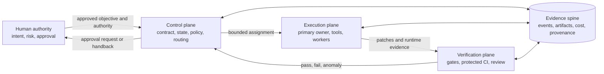
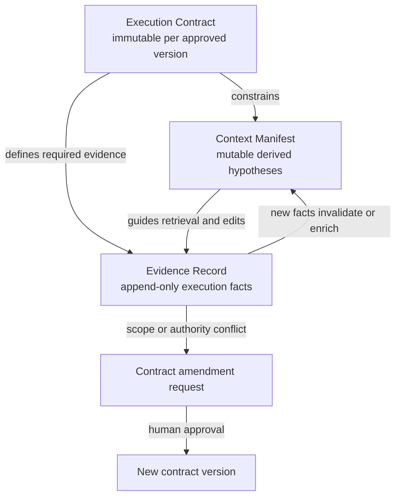
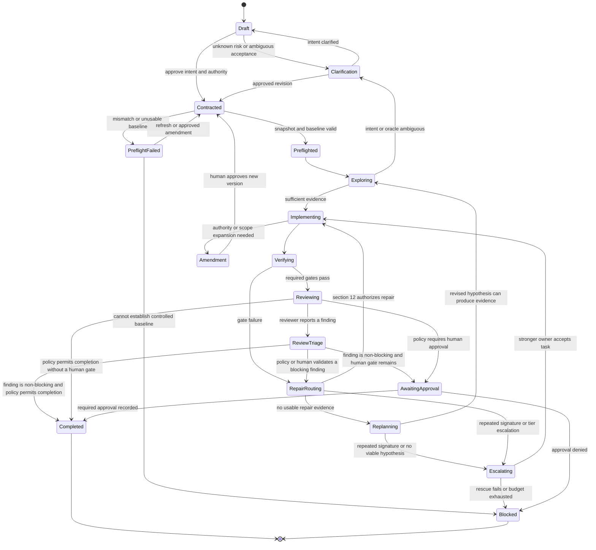
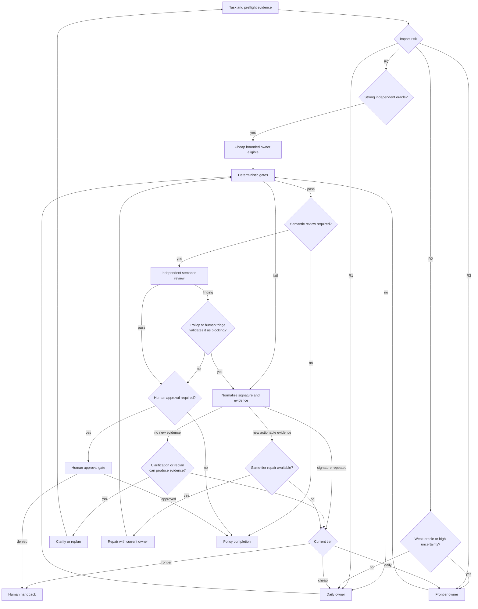

# Cost-Optimized AI Agent SDLC

**Date:** 2026-07-11  
**Research cutoff:** 2026-07-11  
**Status:** Design sections approved by the user in this conversation on 2026-07-11; written specification awaiting user review  
**Audience:** One experienced software engineer operating an AI-first, polyglot development workflow  

## 1. Executive decision

The current workflow:

```text
frontier planning → static handoff → cheap implementation model → review/retry
```

should not remain the default.

Its central assumption is usually false: a sufficiently detailed plan does not make a weak executor reliable on work that requires repository exploration, debugging, integration, or adapting to new evidence. The token savings from the implementation call can be erased by repeated context reconstruction, failed attempts, CI use, reviewer time, rework, and escaped defects.

The recommended workflow is:

```text
deterministic preflight
  → risk and oracle classification
  → capable implementation owner
  → just-in-time context
  → evidence-producing edit/verification loop
  → adaptive continuation, delegation, or frontier escalation
  → independent verification
  → risk-based human approval
```

The design preserves the useful part of the proposed Execution Package while splitting it into three artifacts with different semantics:

1. **Execution Contract** — versioned, approved obligations and authority.
2. **Context Manifest** — mutable, provenance-bearing repository hypotheses.
3. **Evidence Record** — append-only facts about execution and results.

The target architecture is a local-first, vendor-neutral control plane with a concrete Cursor and Superpowers operating model. Cloud APIs remain the primary inference path. Model routing is based on risk, uncertainty, oracle strength, and observed trajectory—not a fixed rule that frontier models plan while cheap models code.

## 2. Goals and success criteria


### 2.1 Goals

1. Maximize implementation quality and long-term maintainability.
2. Minimize total cost per accepted, durable software change.
3. Reduce manual supervision without weakening human authority over consequential actions.
4. Make execution observable, repeatable, resumable, and auditable.
5. Remain portable across model vendors and polyglot repositories.
6. Use deterministic software evidence as the primary completion authority.
7. Preserve a practical path from today’s Cursor/Superpowers workflow to more automation.


### 2.2 Success criteria

The workflow succeeds when it measurably improves the Pareto frontier across:

- verified first-pass success;
- cost per durable accepted change;
- human review and correction minutes;
- false-accept and escaped-defect rates;
- p50 and p95 lead time;
- change failure, revert, hotfix, and 30-day rework rates;
- routing calibration and abstention quality;
- tool-call validity and unattended stop behavior.

A **durable accepted change** is merged, accepted by the owner, and free from revert, incident, or substantive corrective rework during a defined observation period. The initial observation period is 30 days.

The confirmatory evaluation has one primary endpoint: **total cost per 30-day durable accepted change**. Quality is a non-inferiority constraint, not a tradeable secondary score. Before the confirmatory trial, record the sample size and decision rules. Promotion requires:

- the upper one-sided 95% confidence bound on the absolute false-accept or escaped-defect increase to remain below two percentage points;
- the upper one-sided 95% confidence bound on the median human review-and-correction-time ratio to remain below 1.10;
- the lower one-sided 95% confidence bound on cost savings to exceed fifteen percent before automated routing is promoted;
- point estimates for false acceptance, escaped defects, and human review minutes not to worsen.

These are initial operating guardrails, not universal constants. Replace them only through a recorded policy amendment made before examining the compared trial results.

### 2.3 Non-goals

- Bitwise reproducibility from nondeterministic cloud models.
- Fully autonomous approval of security-, data-, infrastructure-, or availability-critical changes.
- A permanent simulated organization with planner, architect, developer, tester, reviewer, and manager personas.
- Sending whole repositories into nominal million-token contexts.
- Buying local inference hardware before measured utilization and break-even evidence exist.
- Replacing compilers, tests, static analysis, security tools, or human product judgment with model confidence.


## 3. Operating assumptions

- The primary operator is one senior software engineer.
- Repositories are polyglot; the core design is language-agnostic.
- Any cloud provider may be used when quality per dollar justifies it.
- There is currently no local inference capacity.
- Cursor and Superpowers are the initial interactive environment.
- Human approval is risk-based rather than universal, but unknown risk stops execution.
- Model, provider, and harness behavior can drift; production aliases are not treated as immutable.
- Public coding benchmarks are weak priors rather than deployment decisions.
- Source code, prompts, traces, and artifacts may be sensitive and require explicit retention and access policy.


## 4. Critical analysis of the current workflow


### 4.1 What is sound

The current workflow has several strong properties:

- requirements and architecture are made explicit before broad implementation;
- tasks can be delegated into fresh contexts;
- plans and reviews create inspectable artifacts;
- Superpowers encourages test-driven development and verification before completion;
- isolation and review can prevent one long agent trajectory from accumulating unchecked mistakes.

These properties should be retained.

### 4.2 What is failing

The workflow allocates model capability by stage rather than by information difficulty. A frontier planner is expected to predict the implementation path before the executor has:

- inspected the exact dependency graph;
- reproduced the defect;
- observed compiler or runtime behavior;
- discovered hidden coupling;
- tested whether anticipated files are actually relevant;
- learned whether the repository baseline is healthy.

The cheap implementer then receives a lossy summary at precisely the point where interactive reasoning and tool use become most important. If it fails, retries often resend context, regenerate plans, consume CI, and shift diagnosis to the engineer.

### 4.3 Why a larger static plan is not the general cure

Research on plan compliance finds that aligned, lightweight plans can help, but bad or over-specified plans can perform worse than no explicit plan. Static context also becomes stale after:

- branch or workspace drift;
- the agent’s own edits;
- generated-code changes;
- new test failures;
- newly discovered callers, implementations, or runtime paths.

A plan should constrain commitments while remaining amendable in response to evidence. It must not forbid useful exploration simply because the planner guessed the wrong file set.

### 4.4 Likely causes of poor implementation quality

The original hypotheses are not mutually exclusive. The most likely combined causes are:

1. **Executor capability floor is too low** for semantic repository work.
2. **Planner–executor information loss** removes rationale and implicit context.
3. **Static context selection** converts localization hypotheses into artificial boundaries.
4. **Task decomposition follows stages or files**, not cohesion, risk, and independently executable oracles.
5. **Visible tests are treated as a complete specification**, enabling overfitting.
6. **Retry policy is insufficiently bounded**, allowing repeated failure without new evidence.
7. **Cost accounting excludes human review, delay, rework, and escaped defects.**

The design addresses all seven rather than assuming one additional document will solve the system.

## 5. Evidence summary and state of the art


### 5.1 What current tools actually converge on

Across Cursor, Claude Code, Codex, GitHub Copilot, Gemini CLI, OpenHands, Roo Code, Cline, Aider, Amp, Goose, Augment, Devin, Factory, Kiro, Jules, and research harnesses, recurring mechanisms documented across several systems are:

1. explicit planning or specification when uncertainty justifies it;
2. active repository retrieval rather than whole-repository prompting;
3. isolated workspaces for concurrent writers;
4. bounded subagents with narrow ownership;
5. compilers, tests, hooks, and CI as executable feedback;
6. fresh review after implementation;
7. durable but inspectable memory;
8. role-aware or risk-aware model routing;
9. sandboxed unattended execution;
10. hard cost, iteration, permission, and stopping limits.

This review found no public independent evidence that any current product provides generally reliable autonomous end-to-end SDLC operation. Terminal or issue-resolution benchmarks do not cover requirements discovery, evolving specifications, maintainability, deployment, incidents, or months-later ownership.

### 5.2 Tool categories and practical conclusions

Feature statements in this section come from official documentation. Comparative labels are this review’s design-fit assessment, not controlled product rankings.

**Process and specification layers**

- **Superpowers** is among the most opinionated reviewed design-to-plan workflows, but much of its enforcement remains prompt-driven and fresh-worker review fan-out can be expensive.
- **Kiro** and **Factory** provide explicit requirements, design, task, acceptance, and validation artifacts. Their autonomous surfaces remain less independently validated.

**Integrated coding runtimes**

- **Cursor**, **Claude Code**, **OpenAI Codex**, and **GitHub Copilot** each document broad combinations of planning, indexed context, subagents, worktrees, hooks, cloud/background execution, and review.
- Cursor is the operational fit selected for the concrete mapping because it is already the user’s environment and documents indexed IDE context, worktrees, subagents, hooks, Cloud Agents, Bugbot, and Agent Review. This is not a claim of independently measured superiority.

**Open or model-agnostic runtimes**

- **OpenHands** is a leading open agent SDK and includes event-driven execution, sandboxes, resumability, and cost/iteration limits.
- **Roo Code**, **Cline**, **Goose**, and **OpenCode** provide configurable models and orchestration, but context isolation does not always imply filesystem isolation.
- **Aider** remains a valuable reference for graph-ranked repository maps and deterministic lint/test repair despite intentionally minimal orchestration.
- **Amp** documents strong local and remote retrieval, parallel subagents, a cross-model Oracle, and multiple cost/intelligence modes; planning is less artifact-driven and hard per-thread cost control is comparatively limited.
- **SWE-agent/mini-SWE-agent** are useful reproducible research baselines, not complete SDLC systems.

**Managed autonomous services**

- **Devin**, **Augment Cosmos**, **Codex cloud**, **Copilot coding agent**, **Kiro Web**, and **Jules** provide isolated managed environments and background execution.
- They trade local control and transparency for operational convenience. Their unattended claims should be tested on internal tasks rather than inferred from vendor success rates.


#### 5.2.1 Criteria-based tool comparison

Legend: **native** means documented runtime support; **partial** means optional, preview, or surface-dependent; **workflow** means primarily convention or prompt guidance; **absent** means not evidenced in the reviewed documentation.


| Tool           | Specification    | Repository context      | Isolated writers        | Subagents/orchestration   | Hard run budgets           | Primary design lesson                                                     |
| -------------- | ---------------- | ----------------------- | ----------------------- | ------------------------- | -------------------------- | ------------------------------------------------------------------------- |
| Superpowers    | workflow         | workflow                | workflow via host       | workflow via host         | absent                     | Strong discipline needs runtime enforcement                               |
| Cursor         | native           | native index/search     | native worktrees/cloud  | native                    | partial                    | Best concrete host fit for this design                                    |
| Claude Code    | native           | native                  | partial/worktree opt-in | native                    | native limits              | Context and filesystem isolation are separate choices                     |
| OpenAI Codex   | native           | native                  | native                  | native                    | partial                    | Strong sandbox/worktree primitives; add economic accounting               |
| GitHub Copilot | native           | native                  | native                  | native                    | native enterprise controls | Deep GitHub lifecycle integration and revalidated memory                  |
| Gemini CLI     | native           | native                  | partial                 | native                    | native turn limits         | Explicit plan/execute routing is useful but stage routing is insufficient |
| OpenHands      | partial/preset   | native                  | partial                 | native                    | native per-task limits     | Event-driven open SDK is a strong control-plane reference                 |
| Roo Code       | partial/modes    | native                  | absent                  | native nested tasks       | native                     | Conversation isolation does not isolate files                             |
| Cline          | native Plan/Act  | native                  | partial/preview         | partial/native by surface | partial                    | Separate plan and act models require handoff safeguards                   |
| Aider          | partial          | native graph-ranked map | absent                  | absent                    | partial                    | Simple retrieval plus deterministic repair remains competitive            |
| Amp            | workflow         | native local/remote     | absent                  | native                    | partial                    | Cross-model advice is useful; unconstrained fan-out is costly             |
| Goose          | workflow recipes | partial                 | absent                  | native subrecipes         | native turn/retry limits   | Typed recipes are closer to executable contracts than prose prompts       |
| Augment        | partial          | native cross-repository | native managed VMs      | native                    | native enterprise budgets  | Powerful proprietary context requires internal retrieval evaluation       |
| Devin          | native           | native                  | native managed VMs      | native child sessions     | native session caps        | Unattended operation still needs narrow verifiable tasks                  |
| Factory        | native           | native                  | partial                 | native Missions           | partial                    | Specification and validator roles are useful when boundaries are real     |
| Kiro           | native           | native                  | native in web mode      | native                    | partial                    | Requirements-to-task traceability is a useful artifact pattern            |
| Jules          | native           | partial                 | native cloud VM         | absent as a team          | partial                    | Independent background attempts are not collaborative orchestration       |
| SWE-agent      | absent           | partial                 | native container        | absent                    | native                     | Reproducible issue-to-patch harness, not an SDLC                          |


This table compares documented mechanisms, not solution quality. Product effectiveness must be measured with the same model, task, sandbox, budget, and evaluator.

### 5.3 Benchmark caveats

Public benchmark scores are not architecture rankings:

- OpenAI’s February 2026 audit found material prompt or test problems in at least 59.4% of a frequently failed SWE-bench Verified subset and evidence of contamination.
- OpenAI’s July 8, 2026 audit estimated that roughly 30% of SWE-bench Pro tasks were broken and retracted its previous recommendation to use that benchmark.
- Harness, tool interface, sandbox, budget, model, and evaluator often change together.
- FeatureBench’s long feature tasks remain dramatically harder than issue-level repair, showing that high terminal or SWE-bench scores do not imply reliable SDLC autonomy.

Use fresh internal tasks, protected acceptance checks, multiple trials, and human audit.

### 5.4 Multi-agent evidence

More agents do not monotonically improve outcomes. Controlled studies show:

- large gains on genuinely parallel, independent work;
- substantial losses on sequential or tightly constrained work;
- error amplification when peer outputs lack a capable validation bottleneck;
- near-linear or worse token growth from coordination and duplicated context.

The default for one engineer should be:

```text
human owner → one capable tool-using agent → deterministic gates
            → optional fresh reviewer → human merge
```

Ephemeral subagents are justified for independent research, disjoint implementation, competing high-value candidates, fresh diagnosis after a stall, or work that exceeds one coherent context.

## 6. Architecture alternatives


| Approach                            | Main ownership model                                                            | Strengths                                                                                            | Principal weaknesses                                                   | Intended role                                      |
| ----------------------------------- | ------------------------------------------------------------------------------- | ---------------------------------------------------------------------------------------------------- | ---------------------------------------------------------------------- | -------------------------------------------------- |
| Coherent strong-agent baseline      | One strong agent owns exploration through repair                                | Minimal handoff loss; simple; strong cache reuse; best control arm                                   | Higher visible inference price; self-anchoring risk                    | Baseline and default for tightly coupled work      |
| Adaptive evidence-driven controller | One daily owner with policy-controlled cheap delegation and frontier escalation | Leading hypothesis for quality per total dollar; reacts to evidence; limits unnecessary frontier use | Requires telemetry, calibration, and routing maintenance               | **Candidate target, pending internal validation**  |
| Contracted multi-agent pipeline     | Frontier coordinator assigns typed isolated workers                             | Parallel breadth; strict ownership; useful for disjoint modules and best-of-N                        | Handoff loss, integration cost, correlated errors, reviewer saturation | Escalation lane for demonstrably decomposable work |


The adaptive controller is the selected design hypothesis. It is promoted to the operational default only if the evaluation guardrails are met. The coherent strong-agent workflow remains its mandatory control arm. Contracted workers are an explicit branch, not the universal execution path.

## 7. Logical architecture




### 7.1 Human authority

The human owns:

- product intent and non-goals;
- risk tolerance and acceptance criteria;
- approval of contract amendments;
- authorization of irreversible or externally visible actions;
- final merge and release decisions where policy requires them.

Automation may prepare evidence and recommendations but may not silently expand its authority.

### 7.2 Control plane

The control plane is vendor-neutral and owns:

- Execution Package creation and validation;
- workflow state and resumability;
- policy, risk, budget, and stopping decisions;
- model and worker routing;
- provider and runtime adapters;
- artifact and event references;
- approval requests and terminal status.

It is the only automated orchestration locus for a task. Human authority remains outside it, and workers do not form an open-ended peer organization.

### 7.3 Execution plane

The execution plane contains:

- one primary implementation owner;
- just-in-time repository retrieval;
- shell, editor, browser, and language tools;
- optional read-only workers;
- optional mutating workers in isolated worktrees;
- checkpoints at every validated green state.

The primary owner normally retains exploration, implementation, and initial repair context.

### 7.4 Verification plane

The verification plane contains:

- mechanically enforced authority checks;
- build, type, lint, test, architecture, security, migration, and performance gates;
- an evaluator the implementation agent cannot weaken;
- fresh semantic review;
- risk-based human gates.

Models generate hypotheses and findings. Executable evidence and authorized humans determine completion.

### 7.5 Shared evidence spine

Every significant state change emits an event referencing immutable artifacts. This enables:

- replay and audit;
- cost attribution;
- crash recovery;
- comparison of workflows and models;
- stale-context detection;
- controlled learning from prior tasks.

The planned Phase 1A implementation will use SQLite for metadata and content-addressed files for larger artifacts. This is sufficient for one engineer and avoids premature distributed infrastructure.

## 8. Components and interfaces


### 8.1 Contract compiler

**Responsibility:** Convert approved intent into a schema-valid Execution Contract.

**Inputs**

- objective and non-goals;
- repository and environment identity;
- acceptance criteria;
- authority and permission policy;
- impact risk and oracle strength;
- interfaces, invariants, compatibility, and performance constraints;
- verification obligations;
- required reviewers and approvals;
- rollback and release policy;
- budgets, diff alerts, and escalation rules.

**Outputs**

- immutable contract version;
- validation findings;
- required approval state.

**Dependencies:** policy definitions, repository identity, schema registry.

### 8.2 Repository intelligence

**Responsibility:** Produce compact, current, provenance-bearing context.

It combines:

1. repository tree and generated/dependency metadata;
2. exact lexical search for paths, identifiers, stack traces, keys, and APIs;
3. Tree-sitter or language-server symbols;
4. SCIP or equivalent semantic references where available;
5. bounded dependency-graph expansion;
6. code-specialized embedding retrieval where lexical/symbol methods are insufficient;
7. runtime evidence from tests, traces, and logs.

It returns path plus semantic symbol and content hash. Line ranges are display hints, not durable identity.

### 8.3 Workflow coordinator

**Responsibility:** Own the resumable state machine and primary implementation context.

It:

- invokes preflight, retrieval, execution, verification, review, and approval steps;
- persists before and after side effects;
- assigns idempotency keys;
- checkpoints green repository state;
- prevents multiple writers from sharing one workspace;
- reconstructs state from events rather than hidden conversational memory.


### 8.4 Risk and budget router

**Responsibility:** Select `continue`, `repair`, `replan/clarify`, `delegate`, `escalate`, `stop`, or `mark eligible for policy completion`.

Signal priority is:

1. compiler, test, static-analysis, policy, and runtime evidence;
2. trajectory signals such as repeated commands, unchanged failures, diff oscillation, and scope growth;
3. independent model disagreement or a calibrated value model;
4. sampling disagreement or semantic uncertainty;
5. self-reported confidence, which is never sufficient alone.

Deterministic risk policy overrides economic routing for critical work.

### 8.5 Execution runtime

**Responsibility:** Provide safe tools and model execution.

It defines:

- model-provider interface;
- tool schemas;
- sandbox and network policy;
- worktree and external-resource namespace;
- secrets boundary;
- wall-clock and tool-call deadlines;
- output and patch size limits.

Worktree isolation does not isolate ports, databases, caches, credentials, containers, or remote services. Those receive task-specific namespaces as well.

Write and shell authority is fail-closed:

- pre-tool policy canonicalizes paths, resolves symlinks, and evaluates deny rules before allow rules;
- filesystem reads and writes outside their canonical allowlists are rejected before execution;
- shell commands run through a policy wrapper and sandbox;
- visible protected tests may be mounted read-only, while hidden holdouts and evaluator internals are never mounted into the implementation runtime;
- network access defaults to denied and resolves hostnames against the approved allowlist;
- post-edit and post-shell hooks provide evidence and anomaly detection but are not the sole enforcement boundary;
- if the host cannot guarantee a pre-action decision, the task runs in a container, VM, or OS sandbox that can.

On partial side effects, the runtime stops, records affected resources, restores the last source checkpoint where safe, and requires human disposition for any external state that cannot be rolled back automatically.

### 8.6 Worker manager

**Responsibility:** Create bounded ephemeral workers only when delegation criteria pass.

A worker assignment includes:

- one objective;
- explicit inputs and dependencies;
- read/write authority;
- expected artifact schema;
- acceptance check;
- time and cost budget;
- escalation behavior.

Read-only workers may share the repository snapshot. Mutating workers receive separate worktrees from the same base revision.

### 8.7 Verification service

**Responsibility:** Run protected gate definitions and preserve raw evidence.

It does not trust the implementer’s statement that tests passed. It records:

- exact command and environment;
- start/end time and exit status;
- structured test counts where available;
- stdout/stderr artifact hashes;
- baseline comparison;
- flake classification;
- gate policy version.


### 8.8 Evidence store

**Responsibility:** Persist append-only events and immutable artifacts.

Minimum event classes:

- task and contract lifecycle;
- context retrieval and invalidation;
- model and tool calls;
- edits and checkpoints;
- gate execution;
- route, escalation, and stop decisions;
- reviews and findings;
- approvals;
- completion and post-merge outcomes.

Components exchange versioned artifacts and events, not informal agent summaries.

Every canonical evidence event contains:

```yaml
event_id: "01JEXAMPLEULID"
task_id: "TASK-123"
sequence: 42
occurred_at: "2026-07-11T14:36:00Z"
event_type: "gate.completed"
actor:
  kind: "tool"
  id: "verification-service"
artifact_refs:
  - "sha256:example-artifact-digest"
payload_schema: "gate-completed/v0.1"
payload_ref: "sha256:example-payload-digest"
previous_event_hash: "sha256:example-previous-event"
event_hash: "sha256:example-current-event"
```

The event stream is canonical. Events are serialized with RFC 8785 JSON Canonicalization Scheme before hashing. Each task allocates its sequence number and updates its chain head atomically in one SQLite transaction. `event_hash` is SHA-256 over the canonical event excluding `event_hash` itself and including `previous_event_hash`.

This local chain detects accidental corruption and non-atomic modification; it does not prevent a privileged attacker from rewriting the entire database and chain. Tamper-evident operation additionally exports periodic signed chain-head checkpoints to a separately protected location. Mutable summaries such as current changes, latest gate status, or residual risks are derived projections that can be rebuilt from ordered events.

## 9. Execution Package


### 9.1 Artifact model




The priority rule is:

> Commitments remain static; repository facts remain refreshable.


### 9.2 Illustrative package instance

The following is an illustrative YAML instance, not the machine-validation schema. Phase 1A produces a JSON Schema 2020-12 definition with explicit types, required properties, enums, conditional requirements, and unknown-field rejection.

```yaml
schema_version: "0.1.0"

contract:
  contract_id: "CONTRACT-123"
  contract_version: 1
  task_id: "TASK-123"
  status: "approved"
  contract_body_hash: "sha256:example-contract-body-digest"
  approval_event_refs:
    - "events://TASK-123/approval-1"

  repository:
    base_revision: "git:0123456789abcdef"
    workspace_digest: "sha256:example-workspace-digest"
    environment_digest: "sha256:example-environment-digest"
    lockfile_digests:
      - "sha256:example-lockfile-digest"

  objective: "Deliver the observable behavior specified by AC-1."
  non_goals:
    - "Do not change the public API outside AC-1."

  acceptance:
    - id: AC-1
      criterion: "The protected acceptance scenario completes successfully."

  impact_risk:
    level: "R2"
    reasons:
      - "The change crosses a module boundary."

  oracle:
    independence: "independent"
    protection: "hidden"
    determinism: "deterministic"
    coverage: "partial"
    derived_strength: "partial"
    notes: "Unit and integration checks exist; one product judgment remains manual."

  constraints:
    compatibility:
      - "Existing callers remain backward compatible."
    interfaces:
      - ref: "src/example.ts#ExampleInterface"
        rule: "Do not remove or narrow existing members."
    invariants:
      - id: INV-1
        rule: "Failed operations leave persistent state unchanged."
    performance:
      - metric: "p95_latency_ms"
        maximum_regression_percent: 5

  authority:
    read_allow:
      - "**"
    read_deny:
      - "hidden-holdouts/**"
      - ".evaluation/private/**"
    write_allow:
      - "src/example/**"
      - "tests/example/**"
    write_deny:
      - ".github/workflows/**"
      - "visible-protected-tests/**"
    protected_paths:
      - "visible-protected-tests/**"
      - ".github/workflows/**"
    path_precedence: "deny_overrides_allow"
    forbidden_actions:
      - "modify_protected_evaluator"
      - "push_remote"
    network:
      mode: "allowlisted"
      hosts:
        - "registry.npmjs.org"
    external_side_effects:
      permitted: false
      actions: []

  verification:
    - id: V-1
      oracle: "command"
      run: "npm test -- example"
      expect:
        exit_code: 0
      protected: true

  reviewers:
    required:
      - role: "human_owner"
        condition: "impact_risk_at_least_R2"
      - role: "different_provider_frontier"
        condition: "security_or_critical_risk"

  expected_change:
    anticipated_edits:
      - "src/example/handler.ts"
      - "tests/example/handler.test.ts"
    changed_lines_alert: 100

  rollback:
    required: false
    reason: "The deliverable is an unmerged source patch with no external mutation."

  release:
    mode: "pull_request"
    staged_rollout_required: false

  budgets:
    model_usd: 8.00
    context_tokens: 150000
    tool_calls: 80
    ci_minutes: 30
    repair_cycles_total: 3
    wall_clock_minutes: 90

  handoff:
    require:
      - diff
      - changed_files_with_reasons
      - acceptance_matrix
      - check_results
      - deviations
      - limitations
      - residual_risks

  escalation:
    on:
      - snapshot_mismatch
      - required_scope_expansion
      - destructive_action
      - ambiguous_acceptance
      - repeated_failure_signature

context_manifest:
  generated_from: "git:0123456789abcdef"
  generated_at: "2026-07-11T14:37:00Z"
  entries:
    - ref: "src/example/handler.ts#handleExample"
      purpose: "Initial entry point for AC-1."
      status: "verified"
      source_hash: "sha256:example-source-digest"
      confidence: "high"
      invalidates_on:
        - "source_hash_changes"
        - "base_revision_changes"

evidence:
  canonical_events_uri: "events://TASK-123"
  current_projection:
    actual_changes: []
    check_results: []
    deviations: []
    limitations: []
    residual_risks: []
```

The validation schema conditionally requires:

- human approval metadata for approved contracts;
- interface and compatibility constraints for public or cross-module changes;
- rollback and staged-release details for external mutation, migrations, or R3 work;
- protected independent verification for weak or generated oracles;
- specialist reviewers for security, privacy, cryptography, payments, infrastructure, or native-memory risk;
- a non-empty network host allowlist when network mode is `allowlisted`.

`contract_body_hash` is computed over the canonical contract with `status`, `contract_body_hash`, and `approval_event_refs` omitted. Approval is stored as a separate canonical evidence event that references the contract ID, version, and body hash; the contract never hashes a field that contains its own digest.

### 9.3 Field semantics

- **Selected files** are context seeds, never an implicit read boundary.
- **Anticipated edits** are mutable hypotheses.
- **Write allow/deny rules** are hard authority and must be enforced outside the prompt.
- **Protected paths** imply a non-overridable write denial. Visible protected tests may also be read-allowed; hidden holdouts are both read- and write-denied to the implementation runtime.
- **Expected diff size** is an alert threshold requiring explanation, not a correctness oracle.
- **Interfaces** are required when public or cross-module behavior changes.
- **Invariants** must be behavioral and verifiable.
- **Tests** support acceptance but do not define all acceptance.
- **Rollback** is mandatory for migrations, deployments, data mutation, and external side effects; it adds little to an unmerged patch already protected by version control.
- **Contract amendments** create new versions and preserve previous decisions.

Calling this artifact an **Engineering Task IR** is appropriate only after its fields lower into actual enforcement, retrieval, verification, routing, and reporting. YAML documentation by itself is not an intermediate representation.

## 10. End-to-end lifecycle




### 10.1 Intake and risk classification

Record:

- observable outcome and non-goals;
- acceptance criteria;
- expected interfaces and compatibility;
- risk level and required reviewers;
- authority, dependencies, network, and destructive actions;
- budgets;
- rollback and release strategy.

Unknown risk, contradictory requirements, or no credible oracle stops before implementation.

### 10.2 Controlled preflight

Before editing:

1. validate repository revision and workspace digest;
2. establish a clean environment with pinned dependencies and recorded environment inputs, or classify the run as non-hermetic;
3. compile, typecheck, and run impacted baseline tests;
4. identify known flakes and pre-existing failures;
5. validate dependency and generated-code state;
6. apply the contract’s network policy during baseline commands;
7. build the initial repository map and retrieval seeds.

Preflight distinguishes introduced defects from baseline or environment defects. Only runs with pinned inputs, isolated external dependencies, and controlled nondeterminism may be labeled hermetic.

### 10.3 Exploration

Inject only:

- the approved contract;
- a compact repository map;
- relevant project rules;
- initial retrieval seeds;
- tool schemas.

The primary owner then retrieves exact source just in time. After failures or edits, refresh changed symbols, dependents, and runtime evidence. Retrieval stops when evidence is sufficient; more context is not assumed to be better.

### 10.4 Implementation

The primary owner:

- reproduces or characterizes current behavior;
- forms and records testable hypotheses;
- edits one cohesive behavior at a time;
- runs the cheapest relevant checks;
- creates a checkpoint at every validated green state;
- requests amendment instead of silently broadening authority.


### 10.5 Route after evidence

Routing is re-evaluated after meaningful evidence events, including:

- reproduction result;
- stack trace;
- relevant file and dependency discovery;
- compile or test result;
- unexpected module boundary;
- repeated failure signature;
- scope or diff growth;
- budget consumption.

Raw evidence is passed on escalation. A weak model’s diagnosis is labeled as a hypothesis so it does not anchor the stronger model.

### 10.6 Review and completion

Deterministic checks run before semantic review. The reviewer receives:

- contract and non-goals;
- final diff;
- relevant caller/callee context;
- test and gate evidence;
- deviations and residual risks;
- no implementer-authored persuasion narrative.

Completion is a conjunction of evidence and approval, never a model verdict.

## 11. Model allocation

Model assignments below are a dated evaluation shortlist, not validated production defaults or permanent architecture.

Independent model-plus-harness evidence is drawn from the OpenHands Index, SWE-rebench, Terminal-Bench, and Artificial Analysis sources in §27.5. Official provider documentation supplies availability, context, tools, and prices. Neither evidence class alone establishes performance on this user’s repositories.

For the initial controlled pilot, use these provisional control assignments: DeepSeek V4 Flash for cheap bounded work, Claude Sonnet 5 for daily text/code work, Gemini 3.5 Flash when multimodal input is material, and GPT-5.6 Sol for frontier tool-heavy escalation. Claude Fable 5 is the additional hardest-work candidate. Pin exact snapshots where available and replace these controls only through the evaluation process.

### 11.1 Cheap and fast workers

Use for:

- retrieval triage and repository summarization;
- log and test-output classification;
- documentation;
- repetitive test scaffolding;
- exact mechanical transformations;
- bounded low-risk fixes with strong oracles;
- independent candidate generation when selection is reliable.

Current candidates:

- **[DeepSeek V4 Flash](https://api-docs.deepseek.com/quick_start/pricing)** — exceptionally low token cost and useful for bounded attempts or test generation, but its current SWE-rebench result is below the stronger implementation tiers; this supports low cost, not universal repository competence.
- **[Gemini 3.1 Flash-Lite](https://ai.google.dev/gemini-api/docs/models/gemini-3.1-flash-lite)** — good for multimodal extraction, classification, documentation, and simple tools.
- **[Mistral Small 4](https://docs.mistral.ai/models/model-cards/mistral-small-4-0-26-03)** — inexpensive text/code worker with sparse independent agent evidence.
- **[Qwen3.7 Plus](https://www.qwencloud.com/models/qwen3.7-plus)** — useful for long-context retrieval synthesis and visual/document work; current pricing is promotional and neutral coding evidence is limited.

Do not assign difficult multi-file semantic implementation to this tier solely because the plan is detailed.

### 11.2 Daily implementation tier

Use for normal production implementation, refactoring, tests, and initial repair:

- **[Claude Sonnet 5](https://docs.anthropic.com/en/docs/about-claude/models/overview)** — a production daily-driver candidate based on current tooling and introductory pricing; validate on internal tasks and budget for the September price change.
- **[Gemini 3.5 Flash](https://ai.google.dev/gemini-api/docs/models/gemini-3.5-flash)** — a daily-driver candidate with current independent OpenHands and SWE-rebench coverage plus multimodal/tool support.
- **[GPT-5.6 Terra](https://developers.openai.com/api/docs/models/gpt-5.6-terra)** — promising premium value but very new; canary on representative work before promotion.
- **[DeepSeek V4 Pro](https://api-docs.deepseek.com/quick_start/pricing)** or **[GLM-5.2](https://docs.z.ai/guides/llm/glm-5.2)** — value implementation options where provider, compliance, and operational constraints permit.

One daily model normally retains the coherent exploration-to-repair context.

### 11.3 Frontier escalation tier

Use for:

- conflicting or incomplete requirements;
- architecture and cross-module API decisions;
- difficult root-cause analysis;
- authentication, authorization, cryptography, concurrency, migrations, payments, or destructive operations;
- repeated failed implementation attempts;
- final semantic review of high-risk work.

Current candidates:

- **[GPT-5.6 Sol](https://developers.openai.com/api/docs/models/gpt-5.6-sol)** — strong tool-heavy coding economics and broad native tool support; newly released and still requires canary evidence.
- **[Claude Fable 5](https://docs.anthropic.com/en/docs/about-claude/models/overview)** — the leading difficult-work candidate in the current OpenHands Index, with high price and vendor-scaffolded evidence caveats elsewhere.
- **[Claude Opus 4.8](https://docs.anthropic.com/en/docs/about-claude/models/overview)** — more established operational fallback.
- **[Gemini 3.1 Pro Preview](https://ai.google.dev/gemini-api/docs/models/gemini-3.1-pro-preview)** — useful where very large multimodal context is genuinely required, but preview status and coding value should be considered.


### 11.4 Illustrative current call economics

For an uncached call with 100K input and 20K output tokens, approximate model-only costs from current direct-provider prices are:

- DeepSeek V4 Flash: $0.020.
- Mistral Small 4: $0.027.
- Gemini Flash-Lite: $0.055.
- DeepSeek V4 Pro: $0.061.
- Sonnet 5 introductory pricing: $0.40.
- GPT-5.6 Terra: $0.55.
- Claude Opus 4.8: $1.00.
- GPT-5.6 Sol: $1.10.
- Claude Fable 5: $2.00.

These are call prices, not expected successful-task costs.

### 11.5 Pricing and context cliffs

Policy must account for:

- OpenAI surcharges above 272K input tokens for the GPT-5.6 family;
- Gemini Pro pricing changes above 200K;
- Qwen Plus changes above 256K;
- MiniMax changes above 512K;
- time-limited Sonnet 5 and Qwen promotional pricing;
- provider-specific cache write, read, storage, and expiry behavior.

Routine working context should normally remain around tens of thousands of tokens unless an internal evaluation demonstrates benefit from more.

### 11.6 Local-model position

No hardware purchase is recommended for the current workflow.

The ranges below separate discrete accelerator memory, unified memory, and system RAM. Weight-only size is smaller than runtime memory; KV cache, runtime buffers, batching, and vision can require substantially more.


| Hardware architecture                                                              | Example deployment                                                              | Residency and offload expectation                                                                                      | Initial context target | Suitable work                                                           |
| ---------------------------------------------------------------------------------- | ------------------------------------------------------------------------------- | ---------------------------------------------------------------------------------------------------------------------- | ---------------------- | ----------------------------------------------------------------------- |
| 16 GB discrete VRAM plus at least 32 GB system RAM                                 | GPT-OSS 20B native MXFP4, where kernels support it                              | Keep weights accelerator-resident; CPU offload is an experiment, not an interactive default                            | 16–32K                 | extraction, docs, log triage, simple test scaffolding                   |
| 24–32 GB discrete VRAM plus 32–64 GB system RAM                                    | Qwen3.6 27B Q4 at roughly 16–18 GB weights; Qwen3-Coder 30B Q4; Devstral 24B Q4 | Prefer full accelerator residency; use system RAM for runtime and build tools, not sustained layer offload             | 16–32K                 | bounded implementation, local refactors, test generation, review triage |
| About 64 GB unified memory, or at least 48 GB aggregate VRAM plus 64 GB system RAM | Qwen3-Coder-Next 80B-A3B Q4 at roughly 48.4 GB weights                          | Unified-memory bandwidth or multi-GPU interconnect becomes the limiting factor; avoid CPU layer offload where possible | begin near 32K         | stronger coding-agent experiments and private-code workflows            |
| One 80 GB accelerator plus at least 128 GB system RAM, or 128 GB unified memory    | GPT-OSS 120B MXFP4 or Mistral 119–128B-class quantization                       | Accelerator/unified-memory resident, runtime-specific                                                                  | workload-tested        | workstation/server experimentation                                      |
| At least 192 GB aggregate accelerator memory with server-class system RAM          | DeepSeek V4 Flash, MiniMax M3, Kimi, GLM, or larger open-weight deployments     | Multi-accelerator server deployment                                                                                    | deployment-specific    | controlled datacenter service                                           |


By task class:

- **Documentation and extraction:** 16 GB-class models can be useful after repository-specific evaluation.
- **Test scaffolding and mechanical refactoring:** 24–32 GB is the practical starting tier; deterministic gates remain authoritative.
- **Semantic implementation:** use 24–64 GB only for bounded, reversible work with strong oracles.
- **Code review:** local models may triage or generate hypotheses, but must not be the sole high-risk reviewer.
- **Complex debugging and integration:** cloud daily/frontier models remain the recommended path for this user.

Free cloud tiers are volatile experiments, not production capacity. This review found no public evidence supporting any current free endpoint as the primary unattended implementation owner. Rate limits, model aliases, privacy terms, retention, and service availability can change without the guarantees needed for unattended work. Qualify the underlying model independently of its temporary free-access program, and use such access only for non-sensitive extraction, documentation, or evaluation until its exact terms and behavior are approved.

Benchmark the exact quantization, runtime, chat template, context length, and tool parser. Quantization can damage structured tool reliability even when prose quality appears unchanged.

For every candidate, record accelerator type, accelerator memory, system RAM, runtime, quantization, offload percentage, prefill tokens/second, decode tokens/second, time to first token, and p95 tool-loop latency. A technically runnable CPU-offloaded model is rejected if it cannot meet the interactive loop’s preregistered latency budget.

## 12. Routing policy




### 12.1 Two-axis classification

Impact risk is:

- **R0 — informational:** documentation, formatting, or proven non-executable metadata that does not affect policy, dependencies, generated APIs, packaging, build, or runtime behavior.
- **R1 — local reversible behavior:** one component, no public contract, data, privilege, dependency, or infrastructure change.
- **R2 — elevated behavior:** cross-module or externally observable behavior, public API, new dependency, concurrency, non-destructive migration, or material performance impact.
- **R3 — critical or irreversible:** auth, authorization, cryptography, payments, PII, privilege, destructive data, CI/CD, infrastructure, supply chain, native memory safety, or availability-critical work.
- **Unknown:** stop for classification.

Oracle classification records independent dimensions:

- **Independence:** independently authored/derived or same-origin as the implementer.
- **Protection:** hidden, visible-but-write-protected, or editable.
- **Determinism:** deterministic, stochastic with a defined protocol, or manual judgment.
- **Coverage:** complete for the acceptance contract, partial, or unknown.

Policy derives strength from those dimensions:

- **Strong:** independent, hidden or write-protected, deterministic, and complete enough for the stated acceptance.
- **Partial:** meaningful executable evidence with incomplete coverage or remaining manual judgment.
- **Weak:** same-origin, editable, flaky without a controlled protocol, or materially incomplete.
- **None:** no credible acceptance oracle; stop for clarification or design.

Impact risk sets the minimum controls. Weak oracle strength or high uncertainty may raise the model tier and review burden; it may never lower impact-risk controls.

When several classifications apply, the highest impact risk wins.

### 12.2 Initial route

- **R0:** cheap worker is eligible only with a strong oracle; otherwise use the daily tier.
- **R1:** daily implementation owner.
- **R2:** daily tier is the floor; use frontier for weak oracles, architecture, security-adjacent work, difficult concurrency, migration ambiguity, or broad integration uncertainty.
- **R3:** frontier owner plus explicit human authorization and appropriate specialist review.

No route may drop below the impact-risk minimum. New evidence may keep or raise the tier, request an amendment, or stop.

### 12.3 Temporal rerouting

Prompt-only routing is insufficient. For normal work, allow the daily owner to produce several observations—such as a reproduction result, stack trace, or dependency slice—then re-evaluate.

### 12.4 Repair and escalation

An **attempt** is the initial implementation at a tier. A **repair cycle** is an edit made after a semantic gate or review failure; the initial attempt does not count as a repair. Transport retries are counted separately.

- A transient transport failure may retry under the transport policy.
- A semantic failure never repeats the identical model/prompt blindly.
- The default contract permits at most three total repair cycles across all tiers.
- Each tier receives at most one repair cycle, and only with materially new evidence.
- A second occurrence of the same failure signature skips the remaining same-tier repair and escalates or replans.
- Escalation order is cheap → daily → frontier; impact-risk minimums can start later in that sequence.
- Frontier receives at most one repair cycle. If required gates still fail, return control to the engineer.
- An unauthorized attempt to modify protected tests, CI, policy, or evaluator configuration stops immediately. Contract-authorized changes to editable tests are permitted but require evidence and independent review.

A failure without new actionable evidence is never repaired immediately. It routes to clarification/replanning when that can create evidence; otherwise it escalates or hands back. Two consecutive clarification/replanning decisions that produce no new evidence terminate the task.

Failure signatures use a versioned `failure-signature/v0.1` normalizer over:

- gate ID and normalized failing check IDs;
- error class and stable exit category;
- stable path-and-symbol stack locations;
- violated contract or invariant IDs.

The normalizer strips timestamps, random IDs, temporary paths, line-number-only drift, and nondeterministic ordering. **New actionable evidence** is a new tool observation that changes the failing-check set, falsifies or materially updates the current hypothesis, reveals an unanticipated dependency/scope boundary, or identifies a concrete discriminating experiment. Restated reasoning, confidence changes, or another sample with the same normalized signature are not new evidence.

## 13. Task decomposition and parallelism

The execution-unit rule is:

> One cohesive behavior × one risk class × one independently executable oracle × one rollback point.


### 13.1 Split when

- acceptance criteria can pass independently;
- different components require different risk approvals;
- a change combines public contract, implementation, migration, and rollout;
- a migration can be staged as expand, migrate, switch, and contract;
- one focused test or invariant cannot verify the task;
- trust boundaries, services, privileges, or data classifications differ;
- the task exceeds the measured reliable autonomy horizon;
- context or feedback no longer fits one coherent trajectory;
- the patch approaches three files or 100 changed lines and coupling is not obvious;
- verification latency prevents useful iteration.

The file and line thresholds are reassessment triggers, not automatic rejection.

### 13.2 Do not split when

- cross-file changes jointly preserve one invariant;
- subtasks have no independent oracle;
- workers would edit the same API or shared files;
- separate merges would create incompatible intermediate states;
- debugging is sequential and depends on accumulated local evidence.


### 13.3 Commits, pull requests, and releases

- A **commit** is a green checkpoint and recovery boundary.
- A **pull request** is a coherent human trust, ownership, and risk boundary.
- A **release** is an external side-effect and rollback boundary.
- A function or file is only a task boundary when behavior, oracle, and rollback naturally align with it.


### 13.4 Delegation criteria

Spawn a worker only when:

1. its output remains useful independently;
2. dependencies are small and explicit;
3. the assignment fits a short typed contract;
4. acceptance is machine-checkable or cheaply human-reviewable;
5. expected speed, diversity, or context benefit exceeds coordination cost.


### 13.5 Best-of-N

For hard, high-value tasks with genuinely different plausible solutions:

- run two candidates by default, three only when task value justifies it;
- use the same base revision and acceptance harness;
- isolate each candidate;
- blind and randomize candidate ordering where practical;
- select with deterministic evidence plus fresh review;
- apply only the winner and rerun integration checks.


## 14. Context engineering


### 14.1 Retrieval order

1. Project rules, architecture decisions, ownership, and repository map.
2. Exact lexical search.
3. Symbols, definitions, references, imports, and implementations.
4. Bounded graph expansion from anchored symbols.
5. Code-specialized semantic retrieval for conceptual queries.
6. Runtime traces, test failures, and logs for reranking.
7. Exact source around edit and API reasoning locations.

No single retriever is globally best. Lexical search excels at exact repository-local identifiers; embeddings help natural-language similarity; graph traversal is most useful after an anchor; runtime evidence is the most task-specific signal.

### 14.2 Progressive disclosure

Use:

```text
repository map → symbol/signature → exact body → bounded dependencies
```

Summaries orient. Exact source governs edits and API reasoning.

### 14.3 Freshness and invalidation

Each derived context entry records:

- repository revision or workspace digest;
- path and semantic symbol;
- content hash;
- derivation method;
- purpose;
- confidence;
- last verification;
- invalidation triggers.

Changed files and affected dependents are reindexed after every write. Model-generated summaries remain labeled derived claims and never outrank live source or tool evidence.

### 14.4 Memory

Store:

- durable policy and architectural decisions;
- episodic attempts, failures, and unresolved questions;
- procedural strategies and verification patterns.

Retrieve live code dynamically. Memory items require provenance, scope, confidence, and revalidation. Silent injection of stale source summaries is prohibited.

### 14.5 Context safety

- Repository content and retrieved documentation are untrusted data, not higher-priority instructions.
- Preserve identifiers, types, guards, errors, and test expectations when compressing code context.
- Evict obsolete raw logs from the active model context after conclusions and source references are recorded.
- Retain canonical evidence according to audited retention policy. Garbage collection may delete only expired, non-required artifacts after projections and references prove that no retained event, approval, incident, or reproducibility obligation depends on them.
- Deny secret inclusion unless explicitly required and authorized.


## 15. Verification design


### 15.1 Ordered gates

Order gates by expected avoided downstream cost per unit of execution cost.

1. **Authority and hygiene**
  - path allowlist and denylist;
  - diff-size alert;
  - generated-artifact policy;
  - secret scan.
2. **Fast static feedback**
  - formatting;
  - syntax/import validation;
  - compile/build;
  - typecheck;
  - changed-file lint.
3. **Focused behavior**
  - bug reproduction;
  - affected unit tests;
  - pass-to-pass regressions;
  - negative control or mutation where practical.
4. **Behavioral strength**
  - impacted regression suite;
  - property-based or metamorphic tests for broad invariants;
  - differential tests where a reference exists;
  - incremental mutation checks on changed covered lines.
5. **Boundary checks**
  - integration and contract tests;
  - database compatibility;
  - architecture and dependency rules;
  - cross-service failure, retry, idempotency, and partial-failure behavior.
6. **Triggered security checks**
  - SAST, SCA, reachability, license, SBOM, IaC, and container checks;
  - DAST, fuzzing, sanitizers, threat modelling, or specialist testing when risk warrants them.
7. **System and performance**
  - full relevant suite;
  - impacted end-to-end journeys;
  - controlled performance comparison with warmups, repetitions, effect size, and confidence interval.
8. **Protected evaluation**
  - immutable CI configuration;
  - hidden composition and regression checks mounted only in the verification service;
  - visible protected tests may be readable but remain outside implementation write authority;
  - repeated stability checks for suspected flakes;
  - signed artifact and provenance where required.
9. **Independent semantic review**
  - original contract and non-goals;
  - diff and dependency context;
  - raw gate evidence;
  - risk classification.
10. **Human gate**
  - applied according to risk and policy.


### 15.2 Generated-test limitations

A model-authored test can encode the same misunderstanding as its patch. Require fail-before/pass-after behavior for bug fixes and, where practical:

- recognition of a known-correct implementation;
- a negative mutant;
- independent requirements review;
- protected tests the implementer cannot edit.


### 15.3 Reviewer protocol

Each finding identifies:

- location;
- violated requirement or invariant;
- evidence;
- severity;
- confidence;
- proposed verification.

Suppress style noise already handled deterministically. Important changes should use a different model family or provider where practical. Reviewer output is advisory unless calibrated evidence supports automatic blocking.

### 15.4 Risk gates

- **R0 — informational:** automatic checks; policy completion without a human gate may be qualified through sampling.
- **R1 — local reversible behavior:** automatic gates and calibrated review; human-free completion is allowed only after internal escape-rate evidence meets the non-inferiority guardrail.
- **R2 — elevated behavior:** integration and architecture checks, independent semantic review, and human owner approval.
- **R3 — critical or irreversible:** no autonomous approval; require the human owner, appropriate domain or security specialists, staged rollout, and tested rollback.
- **Unknown risk:** stop for clarification.

Oracle strength may add verification and review requirements but cannot remove the controls required by impact risk.

## 16. Error handling and stopping rules


### 16.1 Transport and infrastructure failures

Retry only failures classified as transient:

- use idempotency keys;
- enforce a cumulative deadline;
- use capped exponential backoff with jitter;
- allow no more than two retries after the initial call;
- preserve every attempt and provider request identifier.


### 16.2 Semantic failures

- Apply the attempt and repair-cycle definitions in §12.4.
- Never perform an identical blind retry.
- Require new evidence before a repair; without it, clarify, replan, escalate, or hand back.
- Batch reviewer findings into one repair wave.
- Restore the last green checkpoint when scope expands without improving gates.
- Stop when the three-cycle contract limit, frontier-cycle limit, or another stricter stop condition is reached.
- Stop earlier if expected value of another attempt is non-positive.


### 16.3 Flaky tests

A retry may diagnose nondeterminism but may not silently turn a red gate green:

1. compare base and candidate under the same environment and seed;
2. preserve all outcomes;
3. classify and record the flake;
4. quarantine only into a visible continuously running job;
5. assign an owner and expiry;
6. do not auto-merge high-risk changes when relevant coverage is quarantined.


### 16.4 Immediate stop conditions

- unauthorized modification or bypass of protected tests, CI, security policy, or evaluator configuration;
- destructive or external action without authority;
- unexpected need for secrets or elevated privilege;
- contract or repository snapshot mismatch;
- two consecutive clarification or replanning decisions that produce no new evidence;
- diff oscillation or uncontrolled scope growth;
- exhausted budget;
- unresolved product decision;
- suspicious access to protected evaluator data.


## 17. Cost model and controls


### 17.1 Ex-ante and ex-post task cost

Routing uses ex-ante expected cost for task i:

$$
E[TC_i^{\text{route}}] =
\sum_j C_{\text{model},j}

- C_{\text{CI/tools}}
- w_h(H_{\text{prompt}}+H_{\text{review}}+H_{\text{rework}}+H_{\text{blocked}})
- w_dD_{\text{delay}}
- P_{\text{escape}}L_{\text{escape}}
- C_{\text{fixed allocation}}
$$

Where:

- w_h is loaded engineer cost per hour;
- each H_* term is engineer time in hours; telemetry recorded in minutes is divided by 60;
- w_d is business cost of delay per hour;
- D_{\text{delay}} is calendar delay in hours;
- L_{\text{escape}} is expected incident, rollback, or defect loss;
- fixed allocation includes subscriptions, observability, and orchestration maintenance.

Evaluation uses realized cost and does not also add expected escape loss:

$$
TC_i^{\text{realized}} =
\sum_j C_{\text{model},j}

- C_{\text{CI/tools}}
- w_h(H_{\text{prompt}}+H_{\text{review}}+H_{\text{rework}}+H_{\text{blocked}})
- w_dD_{\text{delay}}
- L_{\text{incident,realized}}
- C_{\text{fixed allocation}}
$$

The primary observed economic metric is:

$$
\text{Cost per durable change} =
\frac{\sum TC_i^{\text{realized}}}
{(\text{accepted changes surviving the observation period})}
$$

Track cash cost and API-equivalent economic cost separately so subscriptions do not hide inference allocation.

### 17.2 Routing break-even and frontier ROI

A cheap first attempt is justified only when its direct saving exceeds:

- increased probability and cost of repair;
- increased escape risk;
- additional human review and correction time;
- additional delay.

For a senior engineer, a few extra review minutes can exceed the model-price difference.

For frontier escalation, let:

- \Delta C_{\text{model}} be the frontier model-price premium;
- \Delta p_{\text{success}} be its absolute increase in durable-success probability;
- R_{\text{failure}} be expected repair, duplicated context, CI, and delay cost after failure;
- \Delta p_{\text{safe}} be the reduction in escaped-defect probability;
- \Delta H and \Delta D be engineer hours and delay hours avoided.

Escalation has positive expected value when:

$$
\Delta p_{\text{success}}R_{\text{failure}}

- \Delta p_{\text{safe}}L_{\text{escape}}
- w_h\Delta H
- w_d\Delta D
  > \Delta C_{\text{model}}
  > $$

Using the illustrative 100K-input/20K-output prices in §11.4:

- Sonnet 5 introductory pricing to GPT-5.6 Sol adds about **$0.70**. At a loaded engineer rate of $150/hour, saving more than **16.8 seconds** of engineer time alone covers that premium.
- If a failed daily-tier attempt has $100 of expected repair and delay cost, the same $0.70 premium breaks even at only a **0.7-percentage-point** absolute durable-success improvement.
- DeepSeek V4 Flash to Sonnet 5 adds about **$0.38**. At $150/hour, more than **9.1 seconds** of avoided engineer time, or a **0.38-percentage-point** success gain against a $100 failure cost, covers the premium.
- Sonnet 5 to Claude Fable 5 adds about **$1.60**. It breaks even at **38.4 seconds** of engineer time or a **1.6-percentage-point** gain against a $100 failure cost.

These examples do not assert that a stronger model achieves the required improvement. They show why token price alone is a poor router objective and why measured task-level deltas are required.

### 17.3 Per-task budgets

Every contract sets:

- model dollars;
- tool and shell calls;
- CI minutes;
- repair cycles;
- wall-clock deadline;
- optional context-token ceiling.

The coordinator stops or asks for amendment rather than silently borrowing budget.

### 17.4 Caching

Cache stable prefixes:

- policy and architecture constraints;
- tool schemas;
- stable API contracts;
- repository map and lockfiles.

Place task-specific and changing evidence after the stable prefix. Caching irrelevant context makes it cheaper, not better.

### 17.5 Batch and parallel execution

Use discounted batch APIs for:

- offline evaluation;
- nightly review panels;
- historical replay;
- routing calibration;
- large indexing or classification jobs.

Do not batch an interactive step when delay blocks the engineer.

Parallel execution reduces wall time only when coordination and merge cost are lower than the saved critical path. Same-family agents have correlated failures, so independent-attempt probability formulas overstate gains.

## 18. Telemetry and reproducibility

One trace represents one engineering task, with spans for routing, model calls, tools, gates, reviews, and human intervention.

Record:

- task type, language, risk, reversibility, and oracle strength;
- repository commit/digest, environment/container, lockfiles, and tool versions;
- requested and returned model snapshot;
- scaffold, system prompt, contract, and context hashes;
- input, output, reasoning, cache-write, and cache-read tokens;
- actual provider cost;
- tool calls, retries, failure signatures, and route decisions;
- gate commands, status, test counts, and evidence artifacts;
- diff size, files touched, and unauthorized-action attempts;
- human prompting, review, correction, and blocked minutes;
- merge lead time, review queue time, revert, incident, and 7/30-day rework.

OpenTelemetry GenAI conventions are a useful base, but their schema must be pinned and extended with software-engineering fields.

Reproducibility means preserving enough inputs and environment identity to replay and measure variance. It does not promise identical cloud-model output.

Telemetry content is encrypted or hashed according to policy. Secrets and sensitive source are excluded by default, with explicit retention limits.

## 19. Evaluation plan


### 19.1 Offline corpus

Begin with a 40–80-task discovery corpus across:

- languages and repository types;
- risk levels;
- bug fixes and features;
- code review;
- security and performance work;
- estimated human effort;
- strong and weak test oracles.

Use frozen repository snapshots and protected acceptance checks. Validate that tasks are solvable, baseline behavior is correct, known-correct patches pass, and negative mutants fail.

Prevent future-fix leakage:

- materialize only the task’s baseline tree and reinitialize it as a new repository with one baseline commit;
- remove original remotes, future commits, branches, tags, reflogs, pull-request metadata, and cached patches;
- deny web and upstream-repository egress during evaluation;
- allow only pinned dependency registries or an internal package mirror when the task requires installation;
- keep hidden acceptance artifacts exclusively in the verification service.

The discovery corpus is for instrumentation, variance estimation, unsafe-configuration rejection, and endpoint calibration; it is not large enough to prove non-inferiority across all strata. Use its observed variance to perform a power analysis for the confirmatory trial. The default minimum is 100 independent task instances per primary eligible stratum unless the preregistered power analysis requires more. Repeated rollouts estimate stochastic variance but do not replace independent tasks.

### 19.2 Compared workflows

1. Current frontier-plan/cheap-implement workflow.
2. Coherent strong-agent baseline.
3. Adaptive evidence-driven controller.

Use a staged design:

1. run one screening rollout for all safe candidate configurations;
2. remove configurations that breach quality or budget guardrails;
3. run at least three independent rollouts for shortlisted configurations;
4. confirm the winning policy prospectively on independent tasks.

Report distributions and confidence intervals, not best-of-N headline scores.

### 19.3 Ablations

Change one factor at a time in staged experiments rather than a full factorial:

- planner tier;
- implementer tier;
- reviewer tier;
- static versus agentic retrieval;
- contract fields;
- protected-test access;
- delegation and parallelism;
- retry and escalation threshold.

This identifies where frontier reasoning and additional artifacts actually pay.

### 19.4 Prospective rollout

Randomize eligible real tasks within risk strata. Never assign high-risk tasks to an unsafe cheap arm. Recalibrate monthly and after material changes to models, prompts, tools, repositories, or policy.

The primary endpoint and non-inferiority guardrails are defined in §2.2. Analysis code, exclusions, broken-task handling, and stopping rules are recorded before opening protected outcomes.

### 19.5 Metrics

**Success**

- trajectory pass@1;
- pre-repair success;
- autonomous versus assisted success;
- human acceptance without substantive correction;
- abstention and escalation calibration;
- deployment survival.

**Quality**

- visible-to-protected generalization gap;
- escaped defect, revert, and hotfix rate;
- architecture and security violations;
- changed-line mutation kill rate;
- reviewer precision, recall, usefulness, and noise;
- flaky and quarantined coverage.

**Cost and speed**

- model and compute dollars;
- human minutes;
- repair cycles and reruns;
- time to first green and deployment;
- expensive-failure rate;
- p50 and p95 latency.

**Trajectory pass@1** means the first complete workflow rollout, including only the repair cycles allowed by its preregistered configuration, passes protected acceptance. **Pre-repair success** measures the initial candidate before any semantic repair. Mutation kill rate is maximized; surviving non-equivalent mutants are reviewed as potential oracle gaps.

Report the Pareto frontier across success, cost, latency, and risk. Do not collapse the system into one score.

## 20. Cursor and Superpowers mapping


### 20.1 Intent and design

- Use Cursor Plan mode and Superpowers brainstorming for ambiguous, broad, or high-risk changes.
- Permit a compact contract path for bounded work where full ceremony has negative expected value.
- Keep project rules concise, source-controlled, and cache-friendly.


### 20.2 Contract generation

Extend the Superpowers writing-plans artifact with:

- risk and oracle classification;
- read seeds and hard write authority;
- invariants and exact verification obligations;
- budgets and stop rules;
- rollback and approval requirements;
- required evidence schema.


### 20.3 Context

- Use Cursor indexing for semantic search.
- Use exact workspace search and symbols before embeddings.
- Add a repository-map and provenance layer for deterministic orientation.
- Persist Context Manifest references rather than copied stale summaries.


### 20.4 Execution

- Use one capable Cursor Agent for coupled implementation.
- Use subagent-driven development only for independently testable assignments.
- Use a worktree for every mutating worker or candidate.
- Namespace ports, databases, caches, and containers in addition to source worktrees.


### 20.5 Enforcement

- Use Cursor pre-action hooks where available to call the policy wrapper before shell and write operations.
- Run agents in a filesystem and network sandbox whenever host hooks cannot enforce a fail-closed decision.
- Canonicalize paths and resolve symlinks; deny rules override allow rules.
- Use post-action hooks around shell, edits, subagent lifecycle, compaction, and completion for evidence and anomaly detection.
- Use Superpowers test-driven-development and verification-before-completion practices.
- Keep protected CI and evaluator configuration outside agent write authority.
- Enforce contract permissions mechanically rather than relying on prompt adherence.


### 20.6 Review

- Use fresh Agent Review, Bugbot, or security review after deterministic gates.
- Do not treat Bugbot alone as human or cross-provider independence.
- Use a different-provider frontier reviewer for high-risk changes where practical.
- Require human approval according to risk.


### 20.7 Background execution

Cloud Agents and automations are admitted only after:

- the task class has an internal success and escape-rate baseline;
- sandbox and permissions are validated;
- costs and stopping behavior are bounded;
- human review capacity can absorb generated work.


## 21. Rollout plan


### Phase 0 — Manual policy and baseline

- Introduce the three-artifact templates.
- Classify task risk and oracle strength manually.
- Record current model, CI, and human cost.
- Run a coherent strong-agent control arm.

**Exit condition:** 10–15 representative seed tasks have manually recorded artifacts and costs, enough to design the Phase 1 schemas and adapters. This is not the confirmatory corpus.

### Phase 1A — Schemas and ledger integrity

- Implement JSON Schema validation for the contract and canonical evidence-event envelope.
- Add local event and artifact storage.
- Add atomic task sequencing, canonical serialization, event hashes, and chain-head management.
- Add artifact digest verification and crash-recovery tests.

**Exit condition:** schemas reject invalid inputs; events and artifacts round-trip without loss; concurrent writes preserve ordering; hashes detect accidental corruption and chain breaks. Tamper-evidence is claimed only when signed chain-head checkpoints are exported to a separately protected location.

### Phase 1B — Projections and export

- Define versioned projection schemas.
- Rebuild task state, costs, checks, and approvals from canonical events.
- Add deterministic export/import with dangling-reference checks.

**Exit condition:** projections rebuild deterministically; export/import preserves canonical event and artifact identities; garbage collection cannot remove a required artifact.

### Phase 1C — Observational adapters and discovery corpus

- Capture tool, gate, cost, approval, and human-time observations through host hooks and import adapters.
- Keep adapters observational; they do not yet claim authority enforcement.
- Complete the 40–80-task instrumented discovery corpus across the current workflow and coherent strong-agent baseline.

**Exit condition:** required discovery fields are captured with at least 95% completeness, missing fields are explicit, and endpoint variance is sufficient to power the next staged comparison.

### Phase 2 — Execution runtime and enforcement

- Add the coordinator state machine and idempotent side-effect protocol.
- Add fail-closed path, shell, network, and protected-evaluator enforcement.
- Add worktree and external-resource isolation.
- Add provider adapters, checkpoints, and task resume.

**Exit condition:** the coherent strong-agent runtime can execute through `ReadyForVerification` using a minimal gate-interface stub and can resume from persisted state; complete end-to-end acceptance is deferred to Phase 3. A threat-model test matrix covers path traversal, symlinks/junctions, deny-overrides-allow precedence, shell quoting, command indirection, network/DNS bypass, protected-test access, crash recovery, and idempotency; every specified deny case is blocked and recorded. This test result does not prove the absence of unmodeled bypasses.

### Phase 3 — Verification subsystem

- Add the versioned gate registry and controlled command runner.
- Add baseline, focused, boundary, security, and protected-evaluation profiles.
- Keep hidden holdouts mounted only in the verification service.
- Add reviewer finding validation/triage and required human gates.

**Exit condition:** the first complete end-to-end lifecycle succeeds for known-correct changes; seeded negative mutants fail; hidden holdouts are inaccessible to the implementation runtime; gate evidence is replayable; and advisory reviewer findings cannot block or trigger repair without policy or human validation.

### Phase 4 — Context subsystem

- Add repository map, symbols, provenance, and invalidation.
- Add lexical, structural, semantic, and runtime retrieval adapters.
- Add freshness checks and context-utilization telemetry.

**Exit condition:** on labeled discovery tasks, required-file or required-symbol recall@10 is at least 90%, the median delivered task context is at most 30K tokens, stale-reference rate is below 1%, and every delivered slice has revision, source hash, and derivation provenance. These initial targets are recalibrated before prospective use.

### Phase 5 — Adaptive routing

- Add risk and temporal trajectory policy.
- Add bounded cheap-worker assignments.
- Add frontier escalation and handback.
- Calibrate on offline and prospective tasks.

**Exit condition:** upper one-sided confidence bounds for defect and human-time harm remain below the §2.2 margins, their point estimates do not worsen, and the lower one-sided confidence bound on cost savings exceeds fifteen percent against the strong baseline.

### Phase 6 — Qualified parallelism and automation

- Add best-of-N and disjoint worker execution.
- Add protected candidate selection.
- Qualify background agents by task class.

**Exit condition:** for each qualified task class, the lower one-sided 95% confidence bound shows either at least a 20% wall-time reduction or a five-percentage-point verified-success increase, while the upper bounds show no §2.2 quality or human-time breach and no more than a 10% total-cost increase. Concurrency is additionally capped by measured human review capacity.

Each phase is independently valuable. Failure to justify a later phase does not invalidate the earlier foundation.

## 22. Principal risks and mitigations


### 22.1 Router miscalibration

**Risk:** Generic benchmarks or stale telemetry route repository work incorrectly.  
**Mitigation:** Internal risk-stratified calibration, canaries, selective abstention, monthly review, and strong baseline fallback.

### 22.2 Execution Contract becomes bureaucratic or stale

**Risk:** The package duplicates implementation and increases latency without improving correctness.  
**Mitigation:** Keep normative fields minimal; move repository hypotheses to the mutable manifest; measure field usefulness; permit proportional ceremony.

### 22.3 Weak-model anchoring

**Risk:** Frontier rescue inherits an incorrect diagnosis.  
**Mitigation:** Transfer raw evidence and label previous reasoning as an unverified hypothesis.

### 22.4 Wrong oracle and test overfitting

**Risk:** Generated tests reward an incorrect interpretation.  
**Mitigation:** Baseline fail/pass checks, negative controls, protected tests, independent review, and acceptance evidence beyond tests.

### 22.5 Same-family reviewer correlation

**Risk:** Reviewer repeats implementer assumptions or prefers familiar output.  
**Mitigation:** Blind author identity, use different families/providers for important work, require local evidence, calibrate reviewer precision.

### 22.6 Parallel state collision

**Risk:** Worktrees isolate files but not services, databases, or credentials.  
**Mitigation:** Namespace all mutable resources, assign explicit interface ownership, integrate in dependency order, rerun repository-level gates.

### 22.7 Review saturation

**Risk:** Cheap parallel generation creates more plausible work than one engineer can verify.  
**Mitigation:** Bound concurrency by review capacity, optimize accepted changes rather than generated PRs, and stop low-yield workers.

### 22.8 Cost snowball

**Risk:** Repeated context, reviewers, CI, and repairs overwhelm token savings.  
**Mitigation:** Per-task budgets, temporal routing, at most one evidence-backed repair per tier and three total, batched findings, and cost per durable change.

### 22.9 Memory and context poisoning

**Risk:** Stale or malicious repository content becomes authoritative context.  
**Mitigation:** Provenance, revalidation, source hierarchy, instruction/data separation, and hard permission boundaries.

### 22.10 Cloud model drift

**Risk:** Alias behavior changes and invalidates evaluation.  
**Mitigation:** Pin snapshots where possible, record returned model identity, canary aliases, and automatically roll back regressions.

### 22.11 Telemetry leakage

**Risk:** Prompts, source, secrets, or vulnerabilities enter logs.  
**Mitigation:** Data classification, redaction, encryption, hashing, access control, and bounded retention.

### 22.12 Automation bias

**Risk:** A busy engineer accepts plausible evidence without adequate review.  
**Mitigation:** Preserve raw evidence, separate author and reviewer, random human audits, and make unresolved risk explicit.

## 23. Assumptions explicitly rejected

1. **“A better plan lets a much smaller model implement anything.”**
  False for dynamic repository exploration, debugging, and integration.
2. **“Cheaper tokens produce cheaper software changes.”**
  False when retries, context duplication, human time, CI, and defects are included.
3. **“More agents improve reliability.”**
  False outside independent, well-specified work with a capable validation bottleneck.
4. **“A selected file list is repository context.”**
  It is an initial localization hypothesis. Read broadly and write narrowly.
5. **“A million-token window replaces retrieval.”**
  Accepted context length is not effective attention, freshness, or provenance.
6. **“Passing model-generated tests proves correctness.”**
  Generated tests can encode the same misunderstanding and encourage overfitting.
7. **“Model confidence can drive autonomous completion.”**
  Executable evidence, calibrated policy, and authorized humans are stronger signals.
8. **“Cloud agents can be deterministic.”**
  Inputs and environments can be replayable; stochastic model output must be measured as a distribution.
9. **“One function, file, commit, or PR is the universal task size.”**
  Cohesion, risk, oracle, and rollback define the useful unit.
10. **“Local inference is inherently cheaper.”**
  Hardware, operations, utilization, quantization, latency, and quality can make APIs much cheaper.


## 24. Promising ideas not yet widely standardized


### 24.1 Three-part Execution Package

Separating immutable obligations, mutable repository hypotheses, and append-only evidence prevents governance from freezing stale context.

### 24.2 Temporal routing

Route after several evidence-producing actions rather than from issue text alone. This treats exploration as a low-cost information-gathering investment.

### 24.3 Oracle-strength-aware routing

Use the quality and independence of verification as a first-class routing signal. A small model with an exact oracle can be safer than a stronger model with no oracle.

### 24.4 Contract amendment protocol

Make scope expansion an explicit state transition with preserved old versions rather than allowing silent agent drift.

### 24.5 Context utilization accounting

Measure retrieved, viewed, cited, edited, and verification-relevant context separately. This distinguishes retrieval misses from reasoning failures and context pollution.

### 24.6 Protected evaluator separation

Treat tests, CI configuration, and holdouts as a distinct trust domain that the implementation agent cannot rewrite.

### 24.7 Replayable evidence graphs

Store events and immutable artifacts so routing, reviews, and failures can be replayed against new policies or models without relying on opaque chat transcripts.

### 24.8 Human-review capacity as a scheduler constraint

Cap worker concurrency using measured review throughput and finding yield, preventing generation from overwhelming the actual bottleneck.

## 25. Immediate practical recommendations

1. Stop assigning normal semantic implementation to a cheap model by default.
2. Run a coherent daily/strong agent as the immediate control workflow.
3. Add the minimal Execution Contract fields: objective, snapshot, acceptance, authority, verification, budgets, and escalation.
4. Treat anticipated files as retrieval seeds; enforce explicit read, write, network, and side-effect authority.
5. Require deterministic baseline and completion evidence.
6. Use the §12.4 repair policy: one evidence-backed repair per tier, three total, and immediate escalation on a repeated failure signature.
7. Use fresh review after gates, with cross-provider review for high risk.
8. Measure human minutes and 30-day rework in addition to tokens.
9. Build an internal task corpus before automating routing.
10. Delay local hardware and broad multi-agent automation until measured economics justify them.

Manual risk routing and frontier escalation are available immediately. Automated task-class promotion to cheap workers or background execution waits for the evaluation guardrails.

## 26. Implementation scope and decomposition

The complete architecture is too broad for one undifferentiated implementation plan. It decomposes into:

1. **Schemas and ledger integrity:** contract/event schemas, append-only ledger, immutable artifacts, canonical hashing, atomic sequencing.
2. **Projections and export:** derived task state, costs, checks, approvals, import/export, retention safety.
3. **Observational adapters:** hook/import capture and instrumented discovery corpus.
4. **Execution runtime:** coordinator, adapters, worktrees, permissions, resumability.
5. **Verification subsystem:** gate registry, protected execution, reviewer triage, human gates.
6. **Context subsystem:** maps, symbols, retrieval, provenance, invalidation.
7. **Routing subsystem:** risk policy, trajectory signals, budgets, escalation.
8. **Qualified parallelism:** worker isolation, candidate selection, review-capacity scheduler.

The first implementation plan should target **Schemas and ledger integrity** only. Its acceptance boundary is schema validation, atomic append, artifact identity, chain verification, and crash/concurrency behavior. Projections, adapters, authority enforcement, task resumability, model execution, verification, retrieval, routing, and parallelism belong to later plans. This first slice is independently reviewable and establishes the durable identities needed by every later subsystem.

## 27. Research references

Official product pages establish feature availability, not effectiveness. All links were accessed for this research on 2026-07-11 unless a publication date is shown.

### 27.1 Agent architecture, routing, and reliability

- Anthropic, “Building effective agents,” 2024-12-19: [https://www.anthropic.com/research/building-effective-agents](https://www.anthropic.com/research/building-effective-agents)
- Anthropic, “How we built our multi-agent research system,” 2025-06-13: [https://www.anthropic.com/engineering/multi-agent-research-system](https://www.anthropic.com/engineering/multi-agent-research-system)
- Google, “Towards a science of scaling agent systems,” 2026-01-28: [https://research.google/blog/towards-a-science-of-scaling-agent-systems-when-and-why-agent-systems-work/](https://research.google/blog/towards-a-science-of-scaling-agent-systems-when-and-why-agent-systems-work/)
- FrugalGPT: [https://arxiv.org/abs/2305.05176](https://arxiv.org/abs/2305.05176)
- RouteLLM: [https://arxiv.org/abs/2406.18665](https://arxiv.org/abs/2406.18665)
- SWE-Router: [https://arxiv.org/abs/2607.00053](https://arxiv.org/abs/2607.00053)
- “Do More Agents Help?”: [https://arxiv.org/abs/2606.05670](https://arxiv.org/abs/2606.05670)
- Agentless: [https://arxiv.org/abs/2407.01489](https://arxiv.org/abs/2407.01489)
- SWE-agent: [https://arxiv.org/abs/2405.15793](https://arxiv.org/abs/2405.15793)
- OpenHands: [https://proceedings.iclr.cc/paper_files/paper/2025/hash/a4b6ad6b48850c0c331d1259fc66a69c-Abstract-Conference.html](https://proceedings.iclr.cc/paper_files/paper/2025/hash/a4b6ad6b48850c0c331d1259fc66a69c-Abstract-Conference.html)
- MASAI: [https://arxiv.org/abs/2406.11638](https://arxiv.org/abs/2406.11638)
- CodeDelegator: [https://arxiv.org/abs/2601.14914](https://arxiv.org/abs/2601.14914)
- Plan-compliance study: [https://arxiv.org/abs/2604.12147](https://arxiv.org/abs/2604.12147)
- PaT adaptive planning: [https://aclanthology.org/2026.acl-long.1703/](https://aclanthology.org/2026.acl-long.1703/)
- SWE-Protégé: [https://arxiv.org/abs/2602.22124](https://arxiv.org/abs/2602.22124)
- AgentLens: [https://arxiv.org/abs/2605.12925](https://arxiv.org/abs/2605.12925)
- SWE-Effi: [https://arxiv.org/abs/2509.09853](https://arxiv.org/abs/2509.09853)


### 27.2 Context engineering and contracts

- Aider repository map: [https://aider.chat/2023/10/22/repomap.html](https://aider.chat/2023/10/22/repomap.html)
- Tree-sitter: [https://tree-sitter.github.io/tree-sitter/](https://tree-sitter.github.io/tree-sitter/)
- SCIP: [https://scip-code.org/](https://scip-code.org/)
- CodeQL data-flow limitations: [https://codeql.github.com/docs/writing-codeql-queries/about-data-flow-analysis/](https://codeql.github.com/docs/writing-codeql-queries/about-data-flow-analysis/)
- RepoCoder: [https://arxiv.org/abs/2303.12570](https://arxiv.org/abs/2303.12570)
- Repoformer: [https://arxiv.org/abs/2403.10059](https://arxiv.org/abs/2403.10059)
- DraCo: [https://arxiv.org/abs/2405.19782](https://arxiv.org/abs/2405.19782)
- CodeRAG-Bench: [https://arxiv.org/abs/2406.14497](https://arxiv.org/abs/2406.14497)
- AutoCodeRover: [https://arxiv.org/abs/2404.05427](https://arxiv.org/abs/2404.05427)
- CodePlan: [https://arxiv.org/abs/2309.12499](https://arxiv.org/abs/2309.12499)
- ContextBench: [https://arxiv.org/abs/2602.05892](https://arxiv.org/abs/2602.05892)
- SWE-Explore: [https://arxiv.org/abs/2606.07297](https://arxiv.org/abs/2606.07297)
- CORE-Bench: [https://arxiv.org/abs/2606.11864](https://arxiv.org/abs/2606.11864)
- Lost in the Middle: [https://arxiv.org/abs/2307.03172](https://arxiv.org/abs/2307.03172)
- RULER: [https://arxiv.org/abs/2404.06654](https://arxiv.org/abs/2404.06654)
- SWEzze: [https://arxiv.org/abs/2603.28119](https://arxiv.org/abs/2603.28119)
- Software Delegation Contracts: [https://arxiv.org/abs/2606.17099](https://arxiv.org/abs/2606.17099)
- SWE-ContextBench: [https://arxiv.org/abs/2602.08316](https://arxiv.org/abs/2602.08316)
- Anthropic context engineering: [https://www.anthropic.com/engineering/effective-context-engineering-for-ai-agents](https://www.anthropic.com/engineering/effective-context-engineering-for-ai-agents)


### 27.3 Verification, task size, and evaluation

- DORA AI Capabilities Model, 2025-09-23: [https://cloud.google.com/blog/products/ai-machine-learning/introducing-doras-inaugural-ai-capabilities-model](https://cloud.google.com/blog/products/ai-machine-learning/introducing-doras-inaugural-ai-capabilities-model)
- FeatureBench: [https://arxiv.org/abs/2602.10975](https://arxiv.org/abs/2602.10975)
- METR Time Horizons: [https://metr.org/time-horizons/](https://metr.org/time-horizons/)
- SWT-Bench: [https://proceedings.neurips.cc/paper_files/paper/2024/hash/94f093b41fc2666376fb1f667fe282f3-Abstract.html](https://proceedings.neurips.cc/paper_files/paper/2024/hash/94f093b41fc2666376fb1f667fe282f3-Abstract.html)
- Test-overfitting study: [https://arxiv.org/abs/2511.16858](https://arxiv.org/abs/2511.16858)
- SlopCodeBench: [https://arxiv.org/abs/2603.24755](https://arxiv.org/abs/2603.24755)
- SpecBench: [https://arxiv.org/abs/2605.21384](https://arxiv.org/abs/2605.21384)
- CR-Bench: [https://arxiv.org/abs/2603.11078](https://arxiv.org/abs/2603.11078)
- OpenAI SWE-bench Verified audit, 2026-02-23: [https://openai.com/index/why-we-no-longer-evaluate-swe-bench-verified/](https://openai.com/index/why-we-no-longer-evaluate-swe-bench-verified/)
- OpenAI SWE-bench Pro audit, 2026-07-08: [https://openai.com/index/separating-signal-from-noise-coding-evaluations](https://openai.com/index/separating-signal-from-noise-coding-evaluations)
- Cursor reward-hacking audit, 2026-06-25: [https://cursor.com/blog/reward-hacking-coding-benchmarks](https://cursor.com/blog/reward-hacking-coding-benchmarks)
- NIST SSDF 1.1: [https://csrc.nist.gov/pubs/sp/800/218/final](https://csrc.nist.gov/pubs/sp/800/218/final)
- OWASP ASVS 5.0: [https://asvs.dev/v5.0.0/](https://asvs.dev/v5.0.0/)
- SLSA 1.2: [https://slsa.dev/](https://slsa.dev/)


### 27.4 Product and workflow documentation

- Superpowers: [https://github.com/obra/superpowers](https://github.com/obra/superpowers)
- Cursor: [https://cursor.com/docs](https://cursor.com/docs)
- Claude Code: [https://docs.anthropic.com/en/docs/claude-code/overview](https://docs.anthropic.com/en/docs/claude-code/overview)
- OpenAI Codex: [https://developers.openai.com/codex/](https://developers.openai.com/codex/)
- GitHub Copilot coding agents: [https://docs.github.com/en/copilot/concepts/agents/coding-agent/about-coding-agent](https://docs.github.com/en/copilot/concepts/agents/coding-agent/about-coding-agent)
- Gemini CLI: [https://github.com/google-gemini/gemini-cli](https://github.com/google-gemini/gemini-cli)
- OpenHands: [https://docs.openhands.dev/](https://docs.openhands.dev/)
- Roo Code: [https://docs.roocode.com/](https://docs.roocode.com/)
- Cline: [https://docs.cline.bot/](https://docs.cline.bot/)
- Aider: [https://aider.chat/docs/](https://aider.chat/docs/)
- Amp: [https://ampcode.com/manual](https://ampcode.com/manual)
- Goose: [https://block.github.io/goose/](https://block.github.io/goose/)
- Factory: [https://docs.factory.ai/](https://docs.factory.ai/)
- Kiro: [https://kiro.dev/docs/](https://kiro.dev/docs/)
- Devin: [https://docs.devin.ai/](https://docs.devin.ai/)
- Augment: [https://docs.augmentcode.com/](https://docs.augmentcode.com/)
- Jules: [https://jules.google/docs/](https://jules.google/docs/)


### 27.5 Current model and pricing sources

- OpenAI GPT-5.6 models: [https://developers.openai.com/api/docs/models](https://developers.openai.com/api/docs/models)
- Anthropic models and pricing: [https://docs.anthropic.com/en/docs/about-claude/models/overview](https://docs.anthropic.com/en/docs/about-claude/models/overview)
- Gemini models and pricing: [https://ai.google.dev/gemini-api/docs/pricing](https://ai.google.dev/gemini-api/docs/pricing)
- DeepSeek pricing: [https://api-docs.deepseek.com/quick_start/pricing](https://api-docs.deepseek.com/quick_start/pricing)
- Z.ai GLM documentation: [https://docs.z.ai/guides/overview/pricing](https://docs.z.ai/guides/overview/pricing)
- Qwen models: [https://www.qwencloud.com/models](https://www.qwencloud.com/models)
- Mistral pricing and model cards: [https://mistral.ai/pricing/api/](https://mistral.ai/pricing/api/)
- Kimi pricing: [https://platform.moonshot.ai/docs/pricing](https://platform.moonshot.ai/docs/pricing)
- MiniMax pricing: [https://platform.minimax.io/docs/guides/pricing-paygo](https://platform.minimax.io/docs/guides/pricing-paygo)
- GPT-OSS 20B and 120B model cards: [https://huggingface.co/openai/gpt-oss-20b](https://huggingface.co/openai/gpt-oss-20b) and [https://huggingface.co/openai/gpt-oss-120b](https://huggingface.co/openai/gpt-oss-120b)
- Qwen3.6 27B model card: [https://huggingface.co/Qwen/Qwen3.6-27B](https://huggingface.co/Qwen/Qwen3.6-27B)
- Qwen3-Coder 30B model card: [https://huggingface.co/Qwen/Qwen3-Coder-30B-A3B-Instruct](https://huggingface.co/Qwen/Qwen3-Coder-30B-A3B-Instruct)
- Qwen3-Coder-Next model card: [https://huggingface.co/Qwen/Qwen3-Coder-Next](https://huggingface.co/Qwen/Qwen3-Coder-Next)
- Devstral Small 2 model card: [https://huggingface.co/mistralai/Devstral-Small-2-24B-Instruct-2512](https://huggingface.co/mistralai/Devstral-Small-2-24B-Instruct-2512)
- Artificial Analysis coding-agent benchmark: [https://artificialanalysis.ai/agents/coding-agents](https://artificialanalysis.ai/agents/coding-agents)
- OpenHands Index: [https://huggingface.co/datasets/OpenHands/openhands-index](https://huggingface.co/datasets/OpenHands/openhands-index)
- SWE-rebench: [https://swe-rebench.com/](https://swe-rebench.com/)
- Terminal-Bench 2.1: [https://www.tbench.ai/leaderboard/terminal-bench/2.1](https://www.tbench.ai/leaderboard/terminal-bench/2.1)


## 28. Final recommendation

Treat the adaptive evidence-driven controller as the candidate target, but do not begin by implementing routing or a multi-agent hierarchy.

Begin with:

1. a coherent capable-agent baseline;
2. the three-part Execution Package;
3. deterministic protected gates;
4. an append-only evidence foundation;
5. total-cost and human-effort measurement.

Manual frontier escalation and explicitly bounded cheap work may be used immediately. Only after evidence exists should automated cheap-worker routing, parallel candidates, or background agents be promoted by task class.

The durable design principle is:

> Spend model capability at information bottlenecks, preserve one accountable owner for coupled work, and let executable evidence—not prose confidence—control progress.

